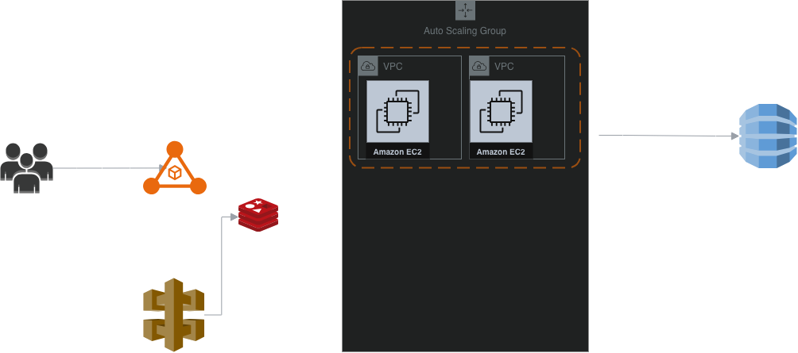

# Solar Energy Monitoring & Asset Management Platform

A portfolio project demonstrating the design and implementation of a scalable renewable energy monitoring and asset management platform.

## Purpose

The system is designed to monitor renewable energy assets, process device telemetry, provide operational dashboards, generate alerts, and support asset management workflows.

## Architecture Goals

- Scalability
- Availability
- Maintainability
- Security
- Performance
- Observability
- Fault tolerance

## Technology Stack

- Angular
- Laravel
- PHP
- MySQL
- Redis
- AWS
- Docker
- REST APIs
- Message Queues

## Project Status

🚧 Architecture and requirements

## Telemetry Reliability

The telemetry processing pipeline implements:

- Idempotency
- Retry with backoff
- Dead Letter Queue
- DLQ inspection
- DLQ replay
- Safe replay through idempotent processing

Architecture:
[Telemetry DLQ Architecture](docs/architecture/telemetry-dlq.md)