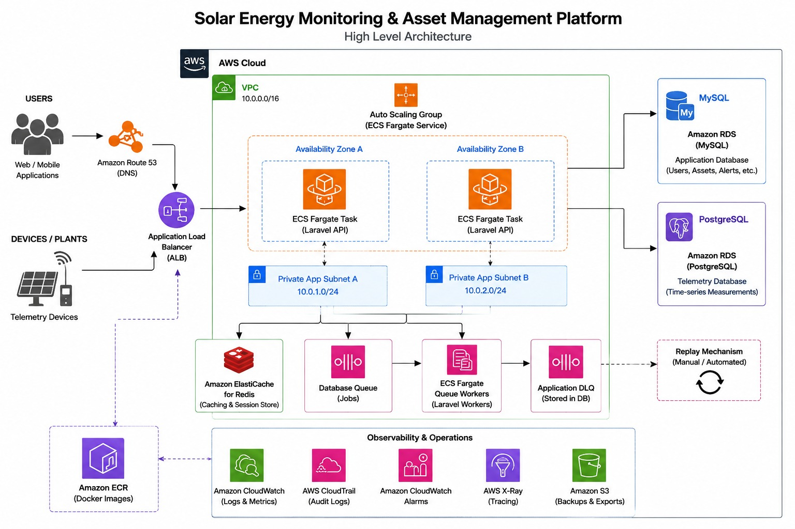

# Solar Energy Monitoring & Asset Management Platform

A portfolio-grade platform for monitoring solar energy assets, processing device telemetry, managing alerts, and demonstrating reliable distributed-system design.

## What this project demonstrates

- Angular frontend and Laravel API
- MySQL application data
- Separate PostgreSQL/Supabase telemetry storage
- Redis-backed asynchronous processing
- Telemetry idempotency
- Retry and backoff
- Dead Letter Queue (DLQ) inspection and replay
- Dockerized application runtime
- GitHub Actions CI/CD
- Automated Render deployment
- Terraform-managed AWS ECS/Fargate deployment path
- ALB health verification and deployment checks

## Architecture

The main telemetry path is:

`Client → Laravel API → Queue → Telemetry Worker → Supabase PostgreSQL`

Failure recovery is:

`Processing failure → Retry → DLQ → Inspect/Replay → Normal processing`

The platform separates synchronous user-facing API operations from asynchronous telemetry processing.



## Repository structure

```text
frontend/                 Angular application
backend/                  Laravel API
docker/                   Runtime Dockerfiles
infrastructure/terraform/ AWS infrastructure
docs/                     Architecture, flows, operations and engineering docs
diagrams/                 Architecture diagrams
.github/workflows/        CI/CD automation
```

## Technology stack

- Angular
- Laravel
- PHP
- MySQL
- PostgreSQL / Supabase
- Redis
- Docker
- GitHub Actions
- Render
- AWS ECS/Fargate
- AWS ECR
- AWS ALB
- Terraform

## Deployment

### Current automated path

GitHub Actions validates the application and, after a successful push to `main`, deploys the backend and frontend to Render.

### AWS path

The repository also contains an AWS ECS/Fargate deployment path using Docker images, ECR, ALB, workers, scheduler and Terraform.

These are separate deployment targets.

## Documentation

Start with the [documentation index](docs/README.md).

Key guides:

- [Getting Started](docs/getting-started.md)
- [Configuration](docs/configuration.md)
- [API Reference](docs/api/api-reference.md)
- [End-to-End Data Flow](docs/architecture/data-flow.md)
- [Telemetry Flow](docs/flows/telemetry-flow.md)
- [Deployment Flow](docs/flows/deployment-flow.md)
- [Monitoring](docs/operations/monitoring.md)
- [Troubleshooting](docs/operations/troubleshooting.md)
- [Security](docs/security/security.md)
- [Release Process](docs/release/release-process.md)

## Infrastructure

Terraform infrastructure lives in `infrastructure/terraform`.

The repository pins Terraform `1.16.0` in:

`infrastructure/terraform/.terraform-version`

Validate from the Terraform directory:

```bash
terraform init
terraform fmt -check
terraform validate
```

## Telemetry reliability

The telemetry processing pipeline implements:

- idempotency
- retry with backoff
- Dead Letter Queue
- DLQ inspection
- DLQ replay
- safe replay through idempotent processing

See [Telemetry DLQ](docs/architecture/telemetry-dlq.md) and [Telemetry Flow](docs/flows/telemetry-flow.md).

## CI/CD

The main CI workflow validates:

1. Angular tests/build
2. Laravel tests/style/syntax
3. Docker images and smoke tests
4. Docker Compose configuration
5. Terraform formatting and validation

Production Render deployment is triggered from `main` only after the required checks succeed.

## Project status

The repository contains implemented application flows plus architecture and operational documentation. Documentation is maintained alongside implementation so behavior and deployment procedures remain discoverable.

